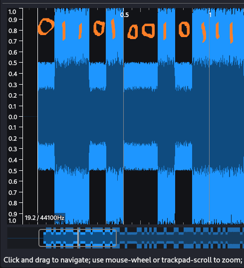

# 8-ball game

In this challenge, we are given a disk.img file through the provided OneDrive link. First, you need to open the file using FTK Imager or Autopsy. Then, search for files named “flag”. You will find many files named “flag”, but only one will be named “flag_description.txt”. You should open that file.

The file contains the following message:

“Flag is not here. All the best, try well. Check all the files, don’t take anything as silly. But I know he loved this: ‘Let’s set each other’s lonely night, be each other’s paradise.’ I don’t know what it is, maybe a key. Check all the possibilities.”

If you search this line on Google, you will find that it is from a song sung by Justin Bieber. So, if you search for “Bieber”, you will see many files. In that, you should open the “Bieber_m” file, which contains hit songs. this challenge can be solved in 2 different ways:

## Approach 1

When you open that file in Sonic Visualizer, you can visually find the 0s and 1s as shown in this image



After finding the 8-bit binary digits, convert them into a string to get the flag.

## Approach 2

For all the programming enthusiasts,

You can write a simple solve script using python and plot the equations using numpy . The script would look something like this:

```import wave
import numpy as np

def extract_binary_from_wave(filename, sample_rate=44100, duration_per_bit=0.1):
    # Open the .wav file
    with wave.open(filename, 'r') as wf:
        n_channels = wf.getnchannels()
        samp_width = wf.getsampwidth()
        framerate = wf.getframerate()
        n_frames = wf.getnframes()
        frames = wf.readframes(n_frames)
        waveform = np.frombuffer(frames, dtype=np.int16)

    n_samples_per_bit = int(sample_rate * duration_per_bit)

    binary_string = ""
    num_bits = len(waveform) // n_samples_per_bit

    for i in range(num_bits):
        segment = waveform[i * n_samples_per_bit:(i + 1) * n_samples_per_bit]

        avg_amplitude = np.mean(np.abs(segment))

        if avg_amplitude > np.mean(np.abs(waveform)) * 0.75:
            binary_string += '1'
        else:
            binary_string += '0'

    return binary_string

input_filename = "/home/kali/hitsongs.wav"

extracted_binary_string = extract_binary_from_wave(input_filename)

print(f"Extracted binary string: {extracted_binary_string}")

```
this code provide binary string: 011010010111001001101111011011100100001101010100010001100111101101101001010111110110001101101000011000010110110001101100011001010110111001100111011001010101111101111001011011110111010101111101
then convert it into string
FLAG: ironCTF{i_challenge_you}
