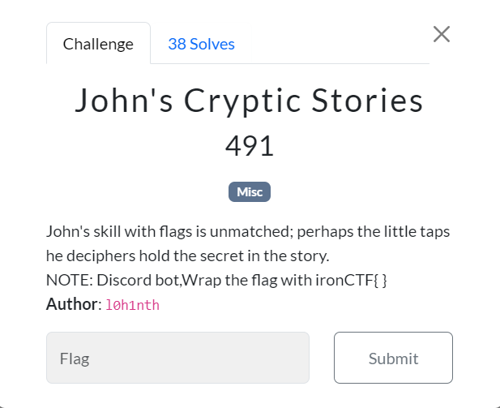

# IRON CTF 2024

# **John's Cryptic Stories Writeup**

The outputs from part0, part1, part2, and part3 contained grammatical errors, with improper use of dashes, and unusual line breaks.

However, If you're familiar with Morse code, you know it's composed of three symbols: a space (" "), a dash ("-"), and a dot (".").

Note:
Each line break in the paragraph represented a space, and when combined with the dots and dashes, they formed a Morse code message.
Upon extracting the morse code manually , you can get 

`-- ----- .-. ... ...-- ..--.- ..- -. ...- ...-- .---- .-.. ..--.- --... .-. ..- --... ....`

FLAG: `ironCTF{M0RS3_UNV31L_7RU7H}`
