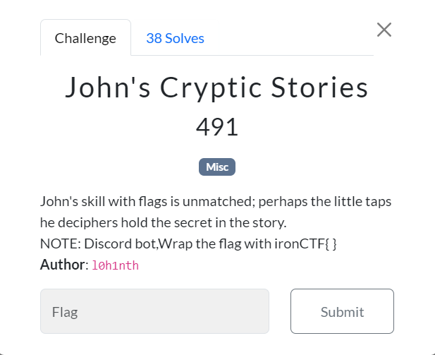

# John's Cryptic Stories



The outputs from part0, part1, part2, and part3 contained grammatical errors, with improper use of dashes, and unusual line breaks.

However, If you're familiar with Morse code, you know it's composed of three symbols: a space (" "), a dash ("-"), and a dot (".").

```txt
!flag
ironCTF{f4ke_fl4g} //To confuse with fake flag
!help
​No Category:
  commands Shows this help message
  flag     Get the flag in DM
  help     Shows this message
  part0    Get part 0 of the story
  part1    Get part 1 of the story
  part2    Get part 2 of the story
  part3    Get part 3 of the story
  story    Get the inspirational story of John

Type !help command for more info on a command.
You can also type !help category for more info on a category.
!part0
Part 0:
The hacker-name-John was well known in the underground
He was known-for-his-skills and could solve even the-toughest-challenges
Late one night. He began-working on a new challenge.
It seemed easy at first. but there was more than met the eye. He tried.
!part1:
Part 1:
He focused. He concentrated. He adapted. He started-seeing-patterns that others missed
He is good. He recognized these hidden clues. With each-clue, his-understanding deepened. His-dedication was unwavering
John could feel the pressure.He struggled. can crack-this, he thought
Time was running-out, but he stayed calm.
Every keystroke mattered. He waited. He was almost at the end. Happiness-was filled
!part2:
Part 2:
Finally. the last piece of the challenge was in place. Success was his. and he-couldn't help-but smile
The breakthrough had come at last. after-long-hours-of-perseverance
His dedication had paid off. Every-detail every clue. that had led to this moment.
He admired. his work with a sense of accomplishment. The hacker-name-John had done it again. solving-the unsolvable
!part3:
Part 3:
He knew this victory was just one of many-to-come, and with that thought. He prepared. He awaited for his next challenge.
As dawn broke. John-reflected on the journey.
Each challenge had sharpened his skills. In each victory. He had strengthened his-resolve
He looked-forward to new-challenge. New mysteries to unravel. New challenges.
The world of hacking was full of secret.He was confident. He believed. He was ready to uncover them all.
!story:
Inspirational story of John 
```

**Note**:

Each line break in the paragraph represented a space, and when combined with the dots and dashes, they formed a Morse code message.
Upon extracting the morse code manually , you can get

`-- ----- .-. ... ...-- ..--.- ..- -. ...- ...-- .---- .-.. ..--.- --... .-. ..- --... ....`

FLAG: `ironCTF{M0RS3_UNV31L_7RU7H}`
