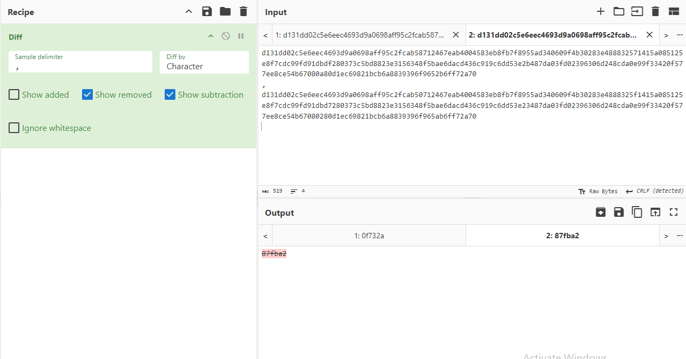

# Same bt Different

The idea behind his challenge is understanding how MD5 Collisions work. A collision occurs when two different input values result in the same hash. This is vulnerability in MD5 is the reason behind using more stonger and secure Hashing schemes.

In the challenge, the final hash value is given and the goal is to find the two hex strings that provide this hash and find the values that differ in both of them. This wikipedia article contains more details about collisions and also the two hex strings: https://en.wikipedia.org/wiki/MD5#Collision_vulnerabilities.

The hex values are:

```d131dd02c5e6eec4 693d9a0698aff95c 2fcab58712467eab 4004583eb8fb7f89
55ad340609f4b302 83e488832571415a 085125e8f7cdc99f d91dbdf280373c5b
d8823e3156348f5b ae6dacd436c919c6 dd53e2b487da03fd 02396306d248cda0
e99f33420f577ee8 ce54b67080a80d1e c69821bcb6a88393 96f9652b6ff72a70

d131dd02c5e6eec4 693d9a0698aff95c 2fcab50712467eab 4004583eb8fb7f89
55ad340609f4b302 83e4888325f1415a 085125e8f7cdc99f d91dbd7280373c5b
d8823e3156348f5b ae6dacd436c919c6 dd53e23487da03fd 02396306d248cda0
e99f33420f577ee8 ce54b67080280d1e c69821bcb6a88393 96f965ab6ff72a70
```

Two find the differences, you can make use of tools like cyberchef.


Hence, the differeneces are: 87fba2 and 0f732a

FLAG: ironCTF{87fba2_0f732a}

