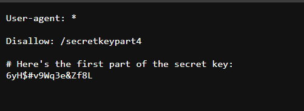
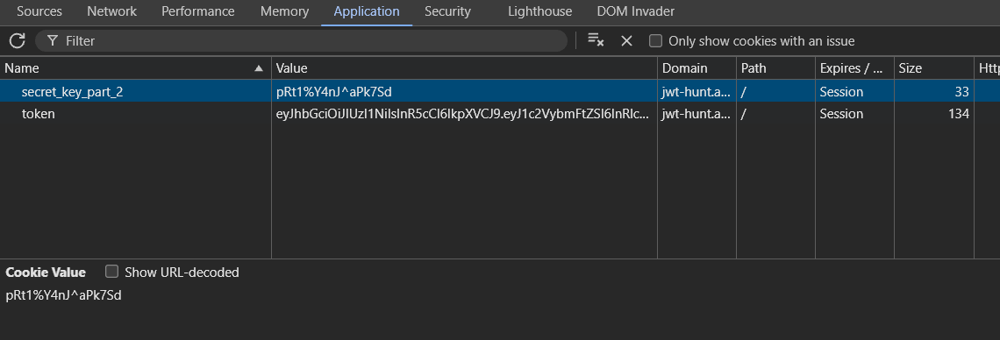
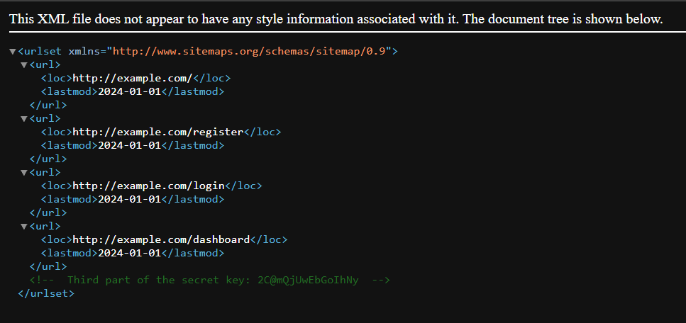
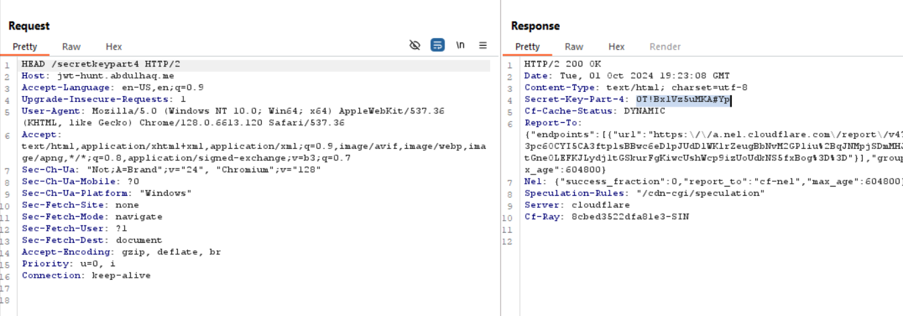

# JWT-Hunt solve

This challenge involves basic JWT (JSON Web Token) modification and the secret key is broken up into 4 parts.
Each part is hidden in different locations in the website.

Here's how to find all the parts of the secret key :

1. "Robots.txt" : In the 'robots.txt', you'll find the first part of the secret key. Also, you'll notice an endpoint '/secretkeypart4'. So, do make a note of it.

2. "Cookies" : Along with the JWT Token, you'll also find the second part of secret key in the cookies.

3. "Sitemap.xml" : Just like 'robots.txt', the 'sitemap.xml' is also a standard endpoint on many websites, and in context of this challenge, you'll find the third part of secret key in it.

4. "/secretkeypart4 endpoint" : If you send a simple GET request to the endpoint, an error page will be thrown. That's the tricky part here. Instead, try sending a HEAD request to the endpoint and you'll find the 4th and final part of secret key in the response headers.

5. Combine all 4 parts and form the secret key.

Now modify the JWT. You can use a website like "jwt.io". Finally edit the JWT token in cookie and refresh the page to get the flag.  
